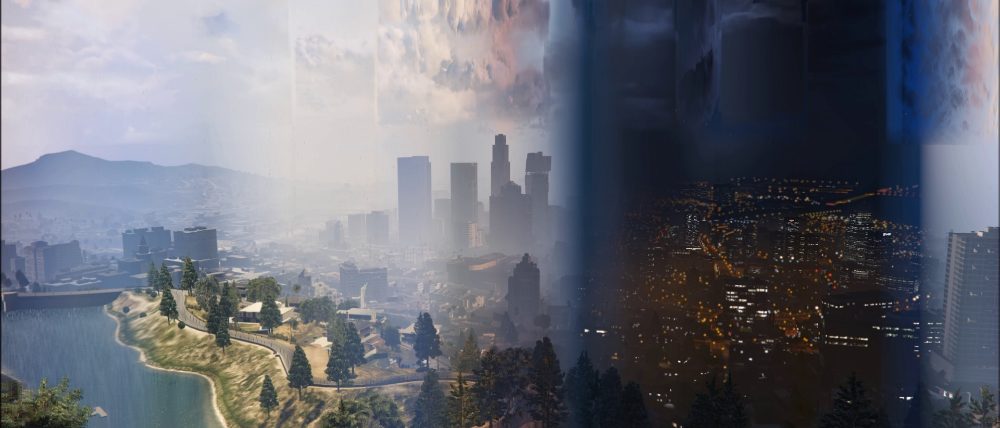

# Timelapse-to-image-converter
Converts an un-sped up fixed camera timelapse video to a single image

**Download:**
https://github.com/Kataiser/Timelapse-to-image-converter/releases

**Installation:**
Extract the .zip to a drive with lots of free storage space, and launch setup.bat.

**Usage:**
Launch run_part1.bat, and enter the filename of a video in the same folder. When that's done, launch run_part2.bat. The final image will be final.png. (Don't open this image while part 2 is running.) Both parts are very time consuming, but part 2 is light enough on cpu to use your pc while it's running.

Note 1: it's highly recommended that the input video
- is quite long, but probably not longer than an hour
- has a fixed camera location and orientation
- is 30 FPS
Note 2: this uses a *massive* amount of storage, potentially hundreds of gigabytes, none of which is automatically deleted. When part 2 is done and final.png is finished, run cleanup.bat.

